# Mechanical 🔧⚙️

[](https://matlab.mathworks.com/open/github/v1?repo=yanndebray/mechanical&file=mechanical.mlx&focus=true)

Resource:


[Marks\-standard\-handbook\-for\-mechanical\-engineers.pdf](https://iem.ca/pdf/resources/Marks-standard-handbook-for-mechanical-engineers.pdf)

<a name="beginToc"></a>

## Table of Contents
&emsp;[Mechanics of solids](#mechanics-of-solids)
 
&emsp;&emsp;[Forces Applied to Support Rigid Bodies](#forces-applied-to-support-rigid-bodies)
 
&emsp;&emsp;[Plane Motion of a Rigid Body](#plane-motion-of-a-rigid-body)
 
&emsp;&emsp;[Friction Brake](#friction-brake)
 
&emsp;&emsp;[Friction](#friction)
 
&emsp;&emsp;[Screws](#screws)
 
&emsp;&emsp;[Thrust Bearing](#thrust-bearing)
 
&emsp;&emsp;[Tension Elements](#tension-elements)
 
<a name="endToc"></a>

# Mechanics of solids
## Forces Applied to Support Rigid Bodies

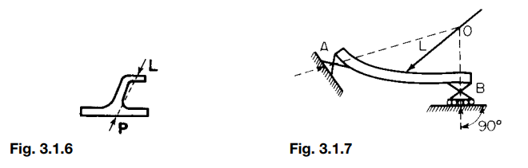


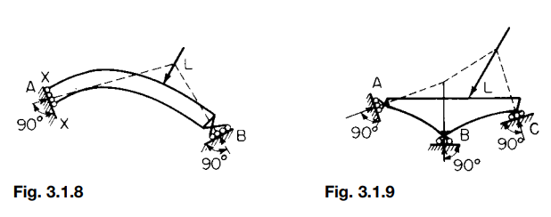

```matlab
% Define forces as [magnitude, angle (in degrees)]
forces = [
    100, 0;    % Force of 100N at 0 degrees (horizontal)
    50, 90;    % Force of 50N at 90 degrees (vertical)
    75, 180    % Force of 75N at 180 degrees (opposite horizontal)
];

% Instantiate the RigidBodyEquilibrium class
rigid_body = RigidBodyEquilibrium(forces);
```

```matlabTextOutput
Horizontal Components (Fx):
  100.0000
    0.0000
  -75.0000

Vertical Components (Fy):
         0
   50.0000
    0.0000
```

```matlab

% Calculate components and check equilibrium
rigid_body.calculateComponents();
```

```matlabTextOutput
Horizontal Components (Fx):
  100.0000
    0.0000
  -75.0000

Vertical Components (Fy):
         0
   50.0000
    0.0000
```

```matlab
rigid_body.checkEquilibrium();
```

```matlabTextOutput
The body is not in equilibrium.
```

## Plane Motion of a Rigid Body

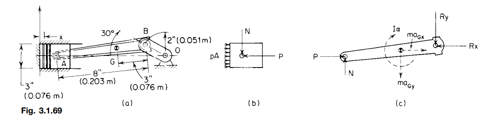

```matlab
% Given data
pressure = 145; % lb/in^2
piston_area = pi/4 * (5)^2; % area in square inches, assuming a diameter of 5 inches
P = pressure * piston_area; % Total force due to expanding gases
mass_piston = 4 / 32.2; % mass of the piston in slugs (lbm to slugs)
mass_rod = 5 / 32.2; % mass of the connecting rod in slugs
crank_radius = 3 / 12; % radius in feet

% Angular velocities and accelerations
omega_OB = 209.4; % rad/s
omega_AB = 45.7; % rad/s
alpha_AB = 5263; % rad/s^2

% Linear acceleration of the piston
a_piston = 7274; % ft/s^2

% Horizontal force component on piston-pin A
P_horizontal = P - mass_piston * a_piston;

% Acceleration of center of gravity G of the connecting rod
r_GB = crank_radius; % distance from G to B
aN_GB = omega_AB^2 * r_GB; % normal component of acceleration
aT_GB = alpha_AB * r_GB; % tangential component of acceleration

% Resultant acceleration of G
aG_x = aT_GB; % x-direction
aG_y = -aN_GB; % y-direction (negative as per example)
aG_magnitude = sqrt(aG_x^2 + aG_y^2); % resultant magnitude

% Resultant external force components
fG_x = mass_rod * aG_x; % Force in x direction
fG_y = mass_rod * aG_y; % Force in y direction

% Calculate Rx using force in x-direction
Rx = P_horizontal - fG_x;

% Solving for Ry and N using moments and forces in y-direction
Ry = 494.7; % as derived from manual calculation in the example
N = 140;    % normal force derived from equilibrium equations

% Display results
fprintf('Horizontal component of piston-pin force (P): %.2f lbf\n', P_horizontal);
```

```matlabTextOutput
Horizontal component of piston-pin force (P): 1943.47 lbf
```

```matlab
fprintf('Resultant acceleration of G in x direction (aG_x): %.2f ft/s^2\n', aG_x);
```

```matlabTextOutput
Resultant acceleration of G in x direction (aG_x): 1315.75 ft/s^2
```

```matlab
fprintf('Resultant acceleration of G in y direction (aG_y): %.2f ft/s^2\n', aG_y);
```

```matlabTextOutput
Resultant acceleration of G in y direction (aG_y): -522.12 ft/s^2
```

```matlab
fprintf('External force in x direction (Rx): %.2f lbf\n', Rx);
```

```matlabTextOutput
External force in x direction (Rx): 1739.16 lbf
```

```matlab
fprintf('External force in y direction (Ry): %.2f lbf\n', Ry);
```

```matlabTextOutput
External force in y direction (Ry): 494.70 lbf
```

```matlab
fprintf('Normal force (N): %.2f lbf\n', N);
```

```matlabTextOutput
Normal force (N): 140.00 lbf
```

## Friction Brake

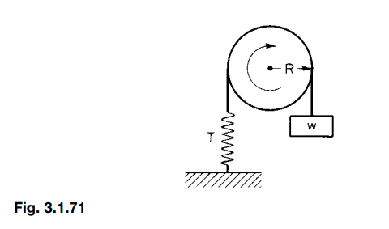

```matlab
% Given data
T = 100;       % Tension on the spring in lbf
w = 20;        % Weight attached to the band in lbf
R = 0.5;       % Radius of the pulley in feet
N = 120;       % Rotational speed in revolutions per minute (r/min)

% Calculate work done per minute against friction
work_per_minute = 2 * pi * R * N * (T - w); % Work in ft-lbf per minute

% Calculate horsepower absorbed by the brake
horsepower = work_per_minute / 33000; % Convert ft-lbf per minute to horsepower

% Display results
fprintf('Work done per minute against friction: %.2f ft-lbf/min\n', work_per_minute);
```

```matlabTextOutput
Work done per minute against friction: 30159.29 ft-lbf/min
```

```matlab
fprintf('Horsepower absorbed by the brake: %.4f hp\n', horsepower);
```

```matlabTextOutput
Horsepower absorbed by the brake: 0.9139 hp
```

## Friction

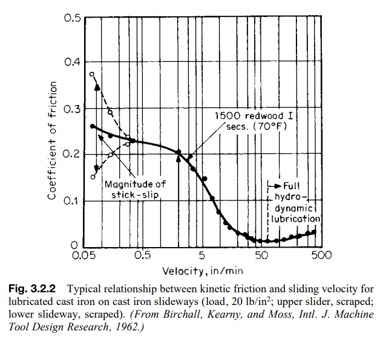

```matlab
% Load the image
img = imread('img/fig_322.png'); % Update with the actual path if needed
imshow(img);
title('Select the origin (0.05 in/min, 0) and top right corner (500 in/min, 0.5) of the plot');
hold on;

% Select two points on the image to define axis scale
% 1st point (bottom-left): (0.05 in/min, 0) in velocity
% 2nd point (top-right): (500 in/min, 0.5) in coefficient of friction
[x_axis, y_axis] = ginput(2); % Manually select the origin and top-right corner of the plot

% Define the real-world coordinates for the selected points
velocity_min = 0.05; % in/min
velocity_max = 500;  % in/min
friction_min = 0;    % coefficient of friction
friction_max = 0.5;  % coefficient of friction

% Calculate pixels per unit for both x and y axes
pixels_per_velocity = (x_axis(2) - x_axis(1)) / (velocity_max - velocity_min);
pixels_per_friction = (y_axis(1) - y_axis(2)) / (friction_max - friction_min);

% Convert pixel coordinates to real-world coordinates
% Manually collect data points along the curve
title('Click along the curve to collect data points, press Enter when done');
[x_curve, y_curve] = ginput; % Select points along the curve
```

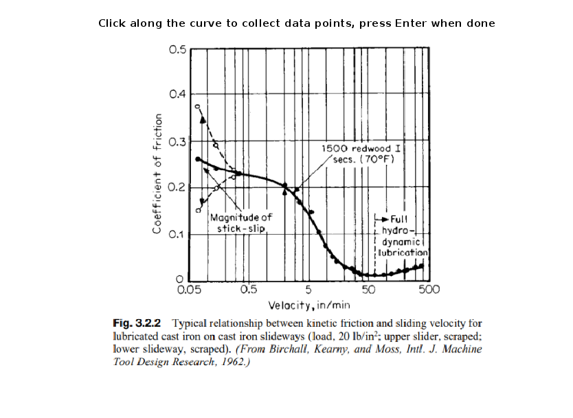

```matlab

% Convert pixel values to real-world values
velocity_data = velocity_min + (x_curve - x_axis(1)) / pixels_per_velocity;
friction_data = friction_min + (y_axis(1) - y_curve) / pixels_per_friction;

% Plot the extracted data
figure;
plot(velocity_data, friction_data, '-o');
xlabel('Velocity (in/min)');
ylabel('Coefficient of Friction');
title('Extracted Data from Graph');
```

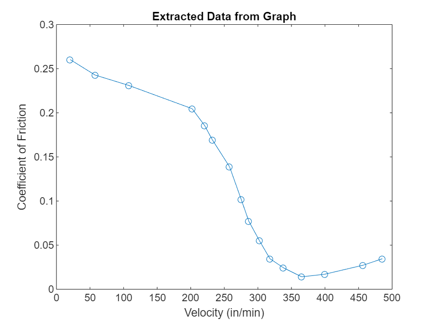

```matlab

% Display extracted data
data_table = table(velocity_data, friction_data, 'VariableNames', {'Velocity_in_min', 'Coefficient_of_Friction'});
disp(data_table);
```

```matlabTextOutput
    Velocity_in_min    Coefficient_of_Friction
    _______________    _______________________

        20.367                 0.26035        
        57.571                 0.24277        
        107.65                 0.23104        
        202.09                 0.20466        
         220.7                 0.18561        
        232.14                 0.16949        
         257.9                 0.13871        
        275.07                 0.10207        
        286.52                0.077159        
        302.26                0.055176        
           318                0.034659        
        338.03                  0.0244        
        365.22                0.014141        
        399.56                0.017072        
         456.8                0.027331        
        485.41                0.034659        
```

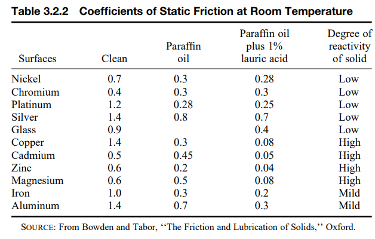

```matlab
% Define the data
surfaces = {'Nickel', 'Chromium', 'Platinum', 'Silver', 'Glass', 'Copper', ...
            'Cadmium', 'Zinc', 'Magnesium', 'Iron', 'Aluminum'};
clean = [0.7, 0.4, 1.2, 1.4, 0.9, 1.4, 0.5, 0.6, 0.6, 1.0, 1.4];
paraffin_oil = [0.3, 0.3, 0.28, 0.8, 0.4, 0.3, 0.45, 0.2, 0.5, 0.3, 0.7];
paraffin_oil_lauric_acid = [0.28, 0.3, 0.25, 0.7, 0.4, 0.08, 0.05, 0.04, 0.08, 0.2, 0.3];
reactivity = {'Low', 'Low', 'Low', 'Low', 'Low', 'High', 'High', 'High', 'High', 'Mild', 'Mild'};

% Create a table
friction_table = table(surfaces', clean', paraffin_oil', paraffin_oil_lauric_acid', reactivity', ...
                       'VariableNames', {'Surfaces', 'Clean', 'ParaffinOil', 'ParaffinOil_LauricAcid', 'Reactivity'})
```
| |Surfaces|Clean|ParaffinOil|ParaffinOil_LauricAcid|Reactivity|
|:--:|:--:|:--:|:--:|:--:|:--:|
|1|'Nickel'|0.7000|0.3000|0.2800|'Low'|
|2|'Chromium'|0.4000|0.3000|0.3000|'Low'|
|3|'Platinum'|1.2000|0.2800|0.2500|'Low'|
|4|'Silver'|1.4000|0.8000|0.7000|'Low'|
|5|'Glass'|0.9000|0.4000|0.4000|'Low'|
|6|'Copper'|1.4000|0.3000|0.0800|'High'|
|7|'Cadmium'|0.5000|0.4500|0.0500|'High'|
|8|'Zinc'|0.6000|0.2000|0.0400|'High'|
|9|'Magnesium'|0.6000|0.5000|0.0800|'High'|
|10|'Iron'|1|0.3000|0.2000|'Mild'|
|11|'Aluminum'|1.4000|0.7000|0.3000|'Mild'|

## Screws

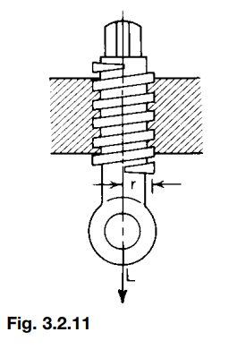

```matlab
% Given Parameters (these can be adjusted as needed)
r = 1; % mean radius of the thread in inches
l = 0.2; % pitch (lead) of the screw in inches
f = 0.1; % coefficient of sliding friction
L = 100; % load applied along the axis of the screw in pounds

% Calculations
% 1. Calculate the angle of inclination (b)
b = atan(l / (2 * pi * r)); % in radians

% 2. Calculate angle a from the coefficient of friction
a = atan(f); % in radians

% 3. Force required P for motion in both directions
P_opposed = L * (l + 2 * pi * r * f) / (2 * pi * r - f * l); % for motion opposed to L
P_same = L * (l - 2 * pi * r * f) / (2 * pi * r + f * l); % for motion in the same direction as L

% 4. Efficiency calculations
efficiency_opposed = tan(b) / tan(b + a); % for motion opposed to L
efficiency_same = tan(b - a) / tan(b); % for motion in the same direction as L

% 5. Maximum efficiency (when b = 45 degrees - a / 2)
b_max = deg2rad(45) - a / 2; % in radians
efficiency_max = tan(b_max) / tan(b_max + a);

% Display results
fprintf('Angle of inclination (b): %.2f degrees\n', rad2deg(b));
```

```matlabTextOutput
Angle of inclination (b): 1.82 degrees
```

```matlab
fprintf('Angle corresponding to friction coefficient (a): %.2f degrees\n', rad2deg(a));
```

```matlabTextOutput
Angle corresponding to friction coefficient (a): 5.71 degrees
```

```matlab
fprintf('Force required (P) for motion opposed to load L: %.2f pounds\n', P_opposed);
```

```matlabTextOutput
Force required (P) for motion opposed to load L: 13.23 pounds
```

```matlab
fprintf('Force required (P) for motion in the same direction as load L: %.2f pounds\n', P_same);
```

```matlabTextOutput
Force required (P) for motion in the same direction as load L: -6.80 pounds
```

```matlab
fprintf('Efficiency for motion opposed to L: %.2f\n', efficiency_opposed);
```

```matlabTextOutput
Efficiency for motion opposed to L: 0.24
```

```matlab
fprintf('Efficiency for motion in the same direction as L: %.2f\n', efficiency_same);
```

```matlabTextOutput
Efficiency for motion in the same direction as L: -2.13
```

```matlab
fprintf('Maximum efficiency (when b = 45 degrees - a / 2): %.2f\n', efficiency_max);
```

```matlabTextOutput
Maximum efficiency (when b = 45 degrees - a / 2): 0.82
```

## Thrust Bearing

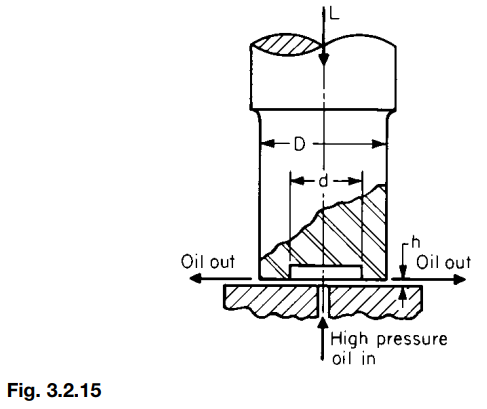

```matlab
% Given parameters for the example
L = 101000; % Load in pounds-force (lbf)
D = 16; % Outer diameter in inches
d = 10; % Inner diameter in inches
h = 0.006; % Oil film thickness in inches
Z = 30; % Viscosity of lubricant in centipoises
n = 750; % Rotational speed in revolutions per minute (r/min)
f_slow = 0.08; % Coefficient of friction for slow speed (can vary between 0.08 and 0.15)
f_high = 0.04; % Coefficient of friction for high speed (can vary between 0.04 and 0.06)
f_oil = 0.001; % Coefficient of friction for oil-lubricated case (range 0.001 to 0.0025)

% Convert viscosity from centipoises to lb.s/in^2 (1 centipoise = 6.7197e-4 lb.s/in^2)
Z_in_lb_s_in2 = Z * 6.7197e-4;

% Convert rotational speed n from r/min to rad/s (1 r/min = 2*pi/60 rad/s)
omega = n * (2 * pi / 60);

% Dry friction moment for ring-shaped flat step bearing
M_dry = (1/3) * f_slow * L * (D^3 - d^3) / (D^2 - d^2); % for slow speed friction
fprintf('Dry friction moment (slow speed): %.2f in-lb\n', M_dry);
```

```matlabTextOutput
Dry friction moment (slow speed): 53452.31 in-lb
```

```matlab

% For oil-lubricated friction moment with externally supplied oil film
M_oil_film = (Z_in_lb_s_in2 * n * (D^4 - d^4)) / (67 * 10^7 * h);
fprintf('Frictional moment with oil film (using Z and n): %.2f in-lb\n', M_oil_film);
```

```matlabTextOutput
Frictional moment with oil film (using Z and n): 0.21 in-lb
```

```matlab

% Alternatively, using absolute viscosity and angular velocity
mu = Z_in_lb_s_in2; % absolute viscosity in lb.s/in^2
M_oil_film_alt = (pi * mu * omega * (D^4 - d^4)) / (32 * h);
fprintf('Alternative frictional moment with oil film (using mu and omega): %.2f in-lb\n', M_oil_film_alt);
```

```matlabTextOutput
Alternative frictional moment with oil film (using mu and omega): 1438746.44 in-lb
```

## Tension Elements

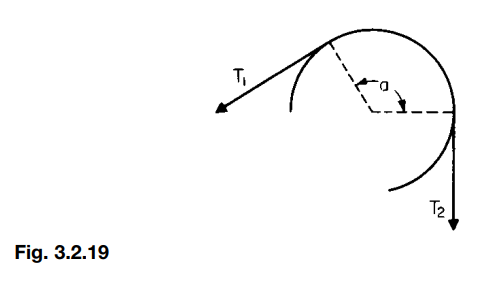

```matlab
% Given parameters
T2 = 100; % Tension T2 in pounds-force (lbf), example value
f = 0.2; % Coefficient of friction, example value
a_deg = 180; % Angle of contact in degrees, example value

% Convert angle from degrees to radians
a = deg2rad(a_deg);

% Calculate T1 using the formula T1 = T2 * exp(f * a)
T1 = T2 * exp(f * a);

% Calculate the circumferential force P using P = (exp(f * a) - 1) * T2
P = (exp(f * a) - 1) * T2;

% Display results
fprintf('Tension T1: %.2f lbf\n', T1);
```

```matlabTextOutput
Tension T1: 187.45 lbf
```

```matlab
fprintf('Circumferential force P (frictional resistance W): %.2f lbf\n', P);
```

```matlabTextOutput
Circumferential force P (frictional resistance W): 87.45 lbf
```

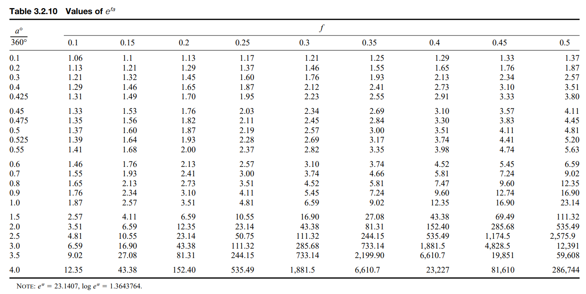

```matlab
img = imread('img/tab_3210.png');
results = ocr(img);
recognizedText = results.Text
```

```matlabTextOutput
recognizedText = 
    'Table 3.2.10 Values of e”
     
      
     
      
     
     a° J
     
     360° 0.1 0.15 0.2 0.25 03 0.35 04 045 0.5
     0.1 1.06 1.1 1.13 1.17 1.21 1.25 1.29 1.33 1.37
     0.2 1.13 1.21 1.29 1.37 1.46 1.55 1.65 1.76 1.87
     0.3 1.21 1.32 1.45 1.60 1.76 1.93 2.13 2.34 2.57
     0.4 1.29 1.46 1.65 1.87 2.12 241 2.73 3.10 351
     0.425 1.31 1.49 1.70 1.95 223 2.55 291 333 3.80
     0.45 133 1.53 1.76 2.03 2.34 2.69 3.10 3.57 4.11
     0.475 1.35 1.56 1.82 2.11 245 2.84 3.30 3.83 4.45
     0.5 1.37 1.60 1.87 2.19 2.57 3.00 351 4.11 4.81
     0.525 1.39 1.64 1.93 228 2.69 3.17 3.74 4.41 5.20
     0.55 1.41 1.68 2.00 237 2.82 335 3.98 4.74 5.63
     0.6 1.46 1.76 2.13 257 3.10 3.74 4.52 5.45 6.59
     0.7 1.55 1.93 241 3.00 3.74 4.66 5.81 7.24 9.02
     0.8 1.65 2.13 2.73 351 4.52 5.81 7.47 9.60 12.35
     0.9 1.76 2.34 3.10 4.11 5.45 7.24 9.60 12.74 16.90
1.0 1.87 2.57 351 4.81 6.59 9.02 12.35 16.90 23.14
2. 5 2.57 4.11 6.59 10.55 16.90 27.08 43.38 69.49 111.32
     2.0 351 6.59 12.35 23.14 43.38 81.31 152.40 285.68 535.49
     25 4.81 10.55 23.14 50.75 111.32 244.15 535.49 1,174.5 2,575.9
     3.0 6.59 16.90 43.38 111.32 285.68 733.14 1,881.5 4,828.5 12,391
     35 9.02 27.08 81.31 244.15 733.14 2,199.90 6,610.7 19,851 59.608
     4.0 12.35 43.38 152.40 535.49 1,881.5 6,610.7 23.227 81,610 286,744
     
     NOTE: e™ = 23.1407, log e™ = 1.3643764.
     
     '

```

```matlab
for i = 1:length(data)
    fprintf('Row %d has %d columns\n', i, numel(data{i}));
end
```

```matlabTextOutput
Row 1 has 5 columns
Row 2 has 1 columns
Row 3 has 1 columns
Row 4 has 2 columns
Row 5 has 10 columns
Row 6 has 10 columns
Row 7 has 10 columns
Row 8 has 10 columns
Row 9 has 10 columns
Row 10 has 10 columns
Row 11 has 10 columns
Row 12 has 10 columns
Row 13 has 10 columns
Row 14 has 10 columns
Row 15 has 10 columns
Row 16 has 10 columns
Row 17 has 10 columns
Row 18 has 10 columns
Row 19 has 10 columns
Row 20 has 10 columns
Row 21 has 10 columns
Row 22 has 10 columns
Row 23 has 10 columns
Row 24 has 10 columns
Row 25 has 10 columns
Row 26 has 10 columns
Row 27 has 8 columns
```

```matlab
% Step 1: Split the recognized text into lines
lines = strsplit(recognizedText, '\n');
lines = lines(~cellfun('isempty', strtrim(lines)));

% Step 2: Correct OCR errors and split lines into columns
data = cell(length(lines), 1);
numCols = zeros(length(lines), 1);
for i = 1:length(lines)
    line = strtrim(lines{i});
    if isempty(line)
        continue;
    end
    % Correct OCR errors in the line
    line = correctOcrErrors(line);
    % Split line into columns based on spaces
    columns = regexp(line, '\s+', 'split');
    columns = columns(~cellfun('isempty', columns));
    data{i} = columns;
    numCols(i) = numel(columns);
end

% Step 3: Extract rows with exactly 10 columns
indicesOf10Cols = find(numCols == 10);
data_10cols = data(indicesOf10Cols);

% Step 4: Create the data matrix
dataMatrix = vertcat(data_10cols{:});

% Step 5: Extract variable names and create table
variableNames = dataMatrix(1, :);
variableNames = regexprep(variableNames, '[^\w]', '');
variableNames = matlab.lang.makeValidName(variableNames);
dataMatrix(1, :) = [];
T = cell2table(dataMatrix, 'VariableNames', variableNames);

% Step 6: Convert data to appropriate types
for i = 1:width(T)
    T.(i) = str2double(T.(i));
end

% Display the table
T
```
| |x360|x01|x015|x02|x025|x03|x035|x04|x045|x05|
|:--:|:--:|:--:|:--:|:--:|:--:|:--:|:--:|:--:|:--:|:--:|
|1|0.1000|1.0600|1.1000|1.1300|1.1700|1.2100|1.2500|1.2900|1.3300|1.3700|
|2|0.2000|1.1300|1.2100|1.2900|1.3700|1.4600|1.5500|1.6500|1.7600|1.8700|
|3|0.3000|1.2100|1.3200|1.4500|1.6000|1.7600|1.9300|2.1300|2.3400|2.5700|
|4|0.4000|1.2900|1.4600|1.6500|1.8700|2.1200|241|2.7300|3.1000|351|
|5|0.4250|1.3100|1.4900|1.7000|1.9500|223|2.5500|291|333|3.8000|
|6|0.4500|133|1.5300|1.7600|2.0300|2.3400|2.6900|3.1000|3.5700|4.1100|
|7|0.4750|1.3500|1.5600|1.8200|2.1100|245|2.8400|3.3000|3.8300|4.4500|
|8|0.5000|1.3700|1.6000|1.8700|2.1900|2.5700|3|351|4.1100|4.8100|
|9|0.5250|1.3900|1.6400|1.9300|228|2.6900|3.1700|3.7400|4.4100|5.2000|
|10|0.5500|1.4100|1.6800|2|237|2.8200|335|3.9800|4.7400|5.6300|
|11|0.6000|1.4600|1.7600|2.1300|257|3.1000|3.7400|4.5200|5.4500|6.5900|
|12|0.7000|1.5500|1.9300|241|3|3.7400|4.6600|5.8100|7.2400|9.0200|
|13|0.8000|1.6500|2.1300|2.7300|351|4.5200|5.8100|7.4700|9.6000|12.3500|
|14|0.9000|1.7600|2.3400|3.1000|4.1100|5.4500|7.2400|9.6000|12.7400|16.9000|

```matlab
% Function to correct OCR errors
function correctedLine = correctOcrErrors(line)
    % Replace '°' and other non-ASCII characters
    line = regexprep(line, '[^\x00-\x7F]', '');
    % Replace missing decimal points in numbers like '03' to '0.3'
    line = regexprep(line, '\b0(\d)\b', '0. !!!EQ_1!!! 1.$2');
    % Replace 'l' or 'I' misread as '1'
    line = regexprep(line, '[lI]', '1');
    % Correct '360°' to '360'
    line = regexprep(line, '360°', '360');
    % Trim whitespace
    correctedLine = strtrim(line);
end
```
